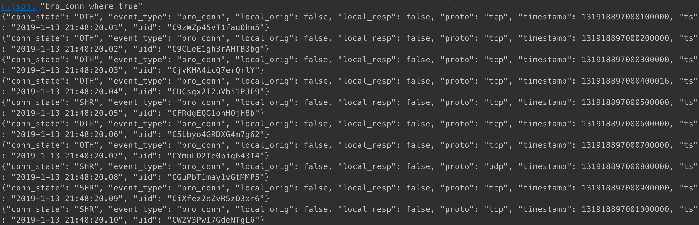
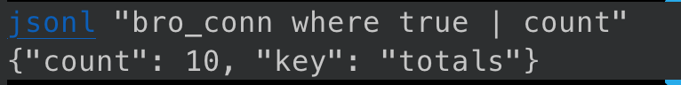
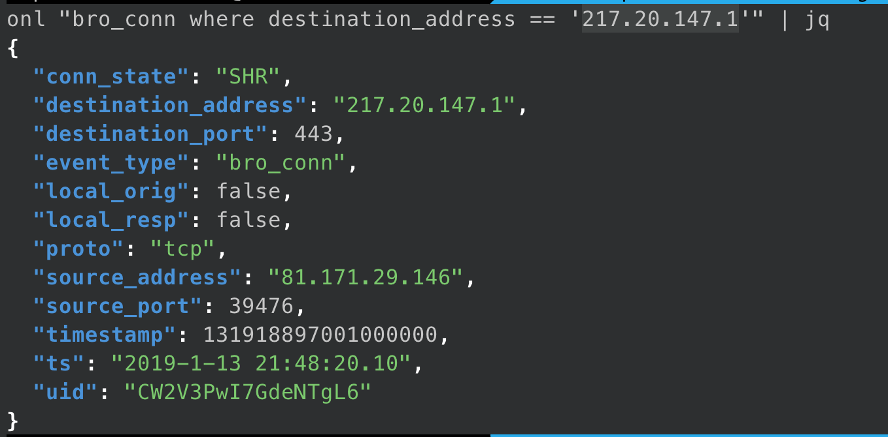
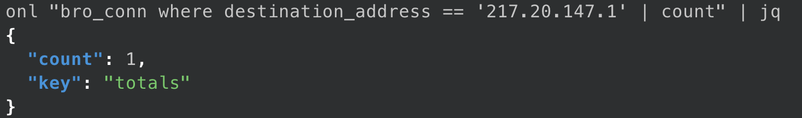
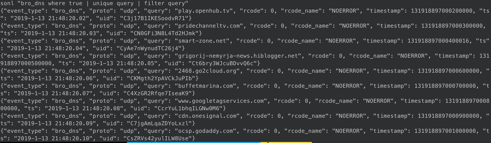
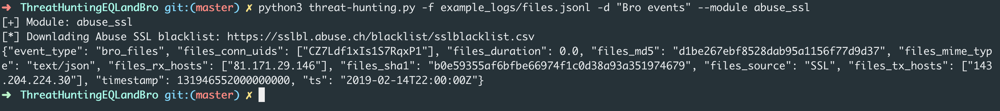
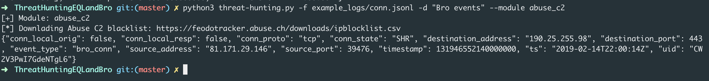
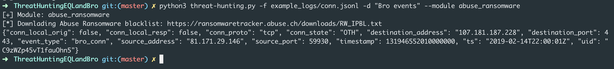

# ThreatHuntingEQLandBro

## Install/Setup EQL and EQLLUB

## EQL

1. `pip3 install eql`
1. `cp bro-schema.json <python3.7 base_dir>/site-packages/eql/etc/schema.json`
    1. Over write default schema
    1. `<python3.7 base_dir>` - `/usr/local/lib/python3.7` on Mac OSX

### EQLLIB

1. `git clone https://github.com/endgameinc/eqllib.git`
1. `cd eqllib`
1. `python setup.py install`
1. `cp bro-domain.toml <python3.7 base_dir>/site-packages/eqllib-*.egg/eqllib/domains/bro-domain.toml`
1. `cp bro-source.toml <python3.7 base_dir>/site-packages/eqllib-*.egg/eqllib/sources/bro.toml`

## Convert BRO logs

Version `0.6.2` of EQL does not parse BRO keys with dots like `id.orig_h` or `id.orig_p`.

1. Mac OSX sed:
    1. `sed -i '' 's:id\.orig_h:dest_addr:g' *.jsonl`
        1. `id.orig_h` --> `dest_addr`
    1. `sed -i '' 's:id\.orig_p:dest_port:g' *.jsonl`
        1. `id.resp_h` --> `dest_port`
    1. `sed -i '' 's:id\.resp_h:src_addr:g' *.jsonl`
        1. `id.resp_p` --> `src_addr`
    1. `sed -i '' 's:id\.resp_p:src_port:g' *.jsonl`
        1. `id\.resp_p` --> `src_port`
    1. `sed -i '' 's/\(:[0-9][0-9]\)\.[0-9]\{6\}/\1/g' *.jsonl`
        1. `2019-02-14T22:00:00.000015` --> `2019-02-14T22:00:00Z`
1. Linux sed:
    1. `sed -i 's:id\.orig_h:dest_addr:g' *.jsonl`
    1. `sed -i 's:id\.orig_p:dest_port:g' *.jsonl`
    1. `sed -i 's:id\.resp_h:src_addr:g' *.jsonl`
    1. `sed -i 's:id\.resp_p:src_port:g' *.jsonl`
    1. `sed -i 's/\(:[0-9][0-9]\)\.[0-9]\{6\}/\1/g' *.jsonl`

## Example Queries with EQL

1. `cd example_logs`
1. Check if new schema, BRO domain, and BRO source are working
    1. `eqllib query -s "Bro events" -f conn.jsonl "bro_conn where true"`
    1. 
1. Count the connections in the conn.log
    1. `eqllib query -s "Bro events" -f conn.jsonl "bro_conn where true | count"`
    1. 
1. Connections with a destination IP addr
    1. `eqllib query -s "Bro events" -f conn.jsonl "bro_conn where destination_address == '217.20.147.1'`
    1. 
1. Count the connections with a destination IP addr
    1. `eqllib query -s "Bro events" -f conn.jsonl "bro_conn where destination_address == '217.20.147.1' | count"`
    1. 
1. Unique DNS queries
    1. `eqllib query -s "Bro events" -f dns.jsonl "bro_dns where true | unique"`
    1. 

## Example queries with eql-hunter.py

1. Check if SHA1 hashes from `files.jsonl` contains a known malicious hash
    1. `python3 eql-hunter.py -f example_logs/files.jsonl -d "Bro events" --module abuse_ssl`
    1. 
1. Check if IP address from `conn.log` contains a known C2 IP address
    1. `python3 eql-hunter.py -f example_logs/conn.jsonl -d "Bro events" --module abuse_c2`
    1. 
1. Check if IP address from `conn.log` contains a known ransomware IP address
    1. `python3 eql-hunter.py -f example_logs/conn.jsonl -d "Bro events" --module abuse_ransomware`
    1. 

## Resources/Sources

* [Github - EQL](https://github.com/endgameinc/eql)
* [Github - EQLLIB](https://github.com/endgameinc/eqllib)
* [ReadTheDocs - EQLLIB - Schema](https://eqllib.readthedocs.io/en/latest/schemas.html#)
* [ReadTheDocs - EQLLIB - Command line](https://eql.readthedocs.io/en/latest/cli.html)
* [Github - EQLLIB - Sysmon source config](https://github.com/endgameinc/eqllib/blob/master/eqllib/sources/sysmon.toml)
* [ReadTheDocs - EQLLIB - Pipes](https://eql.readthedocs.io/en/latest/query-guide/pipes.html#unique)
* [2019-02-15 - QUICK POST: EMOTET TO ICEDID (BOKBOT) TO TRICKBOT](https://www.malware-traffic-analysis.net/2019/02/15/index.html)